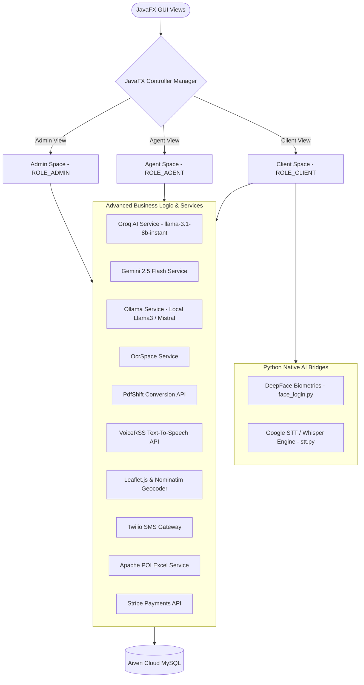
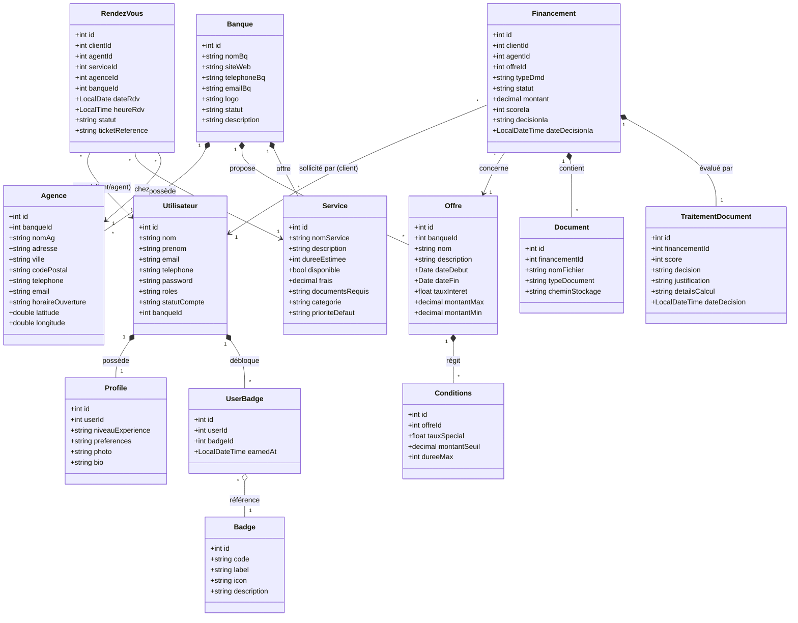

# 🐝 Beeline Desktop Banking Platform
### JavaFX 17 · Maven · MySQL (Aiven Cloud) · Advanced AI (Gemini, Groq, Ollama) · Biometrics · Python STT & DeepFace

An enterprise-grade, state-of-the-art digital banking desktop application designed to redefine client interactions, branch management, and back-office banking operations. Powered by a robust **JavaFX 17** architecture, **Aiven Cloud Databases**, and advanced **Artificial Intelligence**, the platform provides a unified workspace segmented into three dedicated spaces: **Client Space**, **Bank Agent Space**, and **Platform Administrator Space**.

---

## 🔒 Private Repository Notice & Contact Info
> [!IMPORTANT]
> **Showcase Portfolio Notice:** For intellectual property reasons, the source code of this repository is private. This documentation and screenshots serve as an architectural showcase. For access requests, collaborations, or a live demo, contact the author.

* **Developer:** Mehdi Mejri
* **Email:** [mehdimejri15@gmail.com](mailto:mehdimejri15@gmail.com)
* **LinkedIn:** [linkedin.com/in/mehdi-mejri](https://www.linkedin.com/in/mehdi-mejri)

---

## 🏗️ Architectural Topology
The desktop client separates interface rendering from remote services, communicating with cloud components and external API gateways:



---

## 🗂️ Entity Class Schema (UML)
The relational schema of the entities is designed to support the 5 core banking business domains:



---

## 🛠️ Advanced Business Logic ("Métiers Avancés") & AI Integrations

The system's capabilities are divided into five functional modules, each featuring advanced integrations and business rules:

### 1. 👤 User, Authentication & Profile Workspace
* **Facial Biometrics Login:** Combines OpenCV image capture in Java (`FaceRecognitionService`) with DeepFace Python backend (`face_login.py`). Computes real-time face comparisons using a pre-calibrated grayscale absolute difference (`Core.absdiff`) as well as DeepFace Facenet verification.
* **OAuth2 Authentication Server Hook:** Initiates authentication with Google or GitHub APIs by spawning a lightweight local HTTP Server (`com.sun.net.httpserver.HttpServer`) in Java on ports `9090` and `9191` to dynamically capture access token callbacks.
* **Smart reCAPTCHA Integration:** Implements Google reCAPTCHA v2 inside a JavaFX WebEngine. Capable of communicating checkbox status back to the parent Java runtime via JS bridges.
* **Voice-Assisted Registration (Vosk-FR / NLP):** Direct onboarding through dictation. Processes speech signals via Vosk offline models or external engines to automatically fill registration fields, with phonetic normalization for domains.
* **Gamified Badges Engine:** Allocates dynamic visual milestones (Standard ⭐ and VIP 👑) based on savings habits, appointment scheduling, and loan actions.

### 2. 💰 Financing & Document OCR Pipeline
* **Dual-Engine Document Verification:** Analyzes files (CNIs, salary slips, utility bills) uploaded via client wizards. Runs a normalization parser to strip currency signs, correct OCR errors (e.g. `ooo` to `000`), and check formats.
* **Multi-Tier Automated Scoring (Out of 100):** Calculates candidate reliability:
  * **30 Points:** Document set completeness check (Auto vs Pro requirements).
  * **30 Points:** Document structural OCR validity (detecting keywords like `NET À PAYER`).
  * **20 Points:** Presence of essential fields (CNI digits, net income values, utility addresses).
  * **20 Points:** Coherence delta checking (salary age < 3 months, Tunisian identity pattern matches).
* **Explainable AI (XAI) Engine:** Leverages Groq's `llama-3.1-8b-instant` to automatically transform raw numeric scores and failure logs into plain-text decision sheets (Valide, À Corriger, Rejeté) complete with structured tips.
* **Stripe Payment Gateway:** Integrates Stripe's SDK to enable payment of loan processing fees (`Frais de dossier`) during application submissions.

### 3. 📊 Smart Credit Simulator & Live Rates
* **Dynamic Amortization Models:** Simulates Mixed, Variable (e.g., changes after month 24), and Fixed schedules, calculating monthly breakdowns and TAEG.
* **Live Market Rate Sync:** Fetches exchange rates (EUR→USD via ExchangeRate-API, USD→EUR via exchangerate.host) with cached http clients to automatically offset internal loan rate recommendations.
* **Interactive Ollama Chatbot:** Local Mistral/Llama3 chatbot running via Ollama REST bindings. Validates duration requirements, amount bounds, and guides the user to the closest matching promotional loan catalog product.
* **PDFShift Cloud Exporter:** Transcribes simulated terms into A4 documents via PDFShift API. Embeds CSS data graphics, schedules, and custom watermarks.

### 4. 💼 Services & Branch Management
* **OSM leafleting & Nominatim Geocoding:** Displays interactive maps (`agency-map.html`) inside JavaFX WebView using Leaflet.js. Converts plain-text addresses to Tunisian geographic coordinates using the OpenStreetMap Nominatim Client.
* **Branch Catalog Controls:** AJAX-style status toggles that updates database state on the fly.
* **Speech Synthesizer (TTS):** Uses Windows PowerShell SAPI Speech Synthesis to read bank details and descriptions dynamically in French without UI threads freezing.

### 5. 📅 Smart Appointment Scheduler (RendezVous)
* **Overlap-Free Guichet Allocation:** A scheduler algorithm that sweeps database calendar time intervals (`StartA < EndB AND EndA > StartB`) to allocate branch counter resources without conflicts.
* **visio Jitsi Meet Integration:** Instantly spins up Jitsi visual rooms `https://meet.jit.si/BeelineRDV-{rdvId}-{clientId}` for remote consultations.
* **iCalendar (.ics) Sync Export:** Generates RFC-5545 calendar files. Spawns OS-level calendar processes (Outlook, Google Calendar, OS X Calendar) using native Java Desktop opening.
* **Gemini 2.5 Flash CRM Copilot:** Natural Language interface that acts as an Agent Assistant. Understands prompts like *"Annuler le rendez-vous #4"* or *"Rapport du service automobile"*, executing SQL commands and replying in styled Markdown.

---

## 🎨 Workspace Breakdowns

### 1. Client Space (ROLE_CLIENT)
* **Dashboard Hub:** View accounts, active loans, badges, and today's branch visits.
* **Loan Wizard:** Upload documents, execute OCR, check score, pay files via Stripe, view XAI feedbacks.
* **Credit Chatbot:** Converse with local Ollama to find matching financing options.
* **Appointment Booker:** Check time-slots, preview branch Leaflet map, print QR tickets.

### 2. Agent Space (ROLE_AGENT)
* **CRM Console:** Monitor branch metrics, client applications, and appointment schedules.
* **FullCalendar Agenda:** WebView grid displaying appointments. Supports interactive modal controls.
* **Gemini CRM Copilot:** Chat interface to schedule, cancel, print PDF reports, or export calendar schedules.
* **Catalog Manager:** CRUD editing for services, interest rates, and promotions.

### 3. Admin Space (ROLE_ADMIN)
* **Platform Governance:** Distribution statistics, active user counters, and transactional charts.
* **Registration Review:** Onboard banking agents, check branches credentials, approve or block users.
* **Central Database Manager:** Review catalogs, offers list, and loan logs.

---

## 🖼️ Magnificent Screenshots Gallery
🎯 **Live screenshots of the three workspaces in action**

### 🔐 Authentication & Onboarding
<table width="100%">
  <tr>
    <td width="33%" align="center">
      <br/>
      <b>🔑 Smart Login & Biometrics</b>
    </td>
    <td width="33%" align="center">
      <br/>
      <b>🎙️ Voice-Assisted Registration</b>
    </td>
    <td width="33%" align="center">
      <br/>
      <b>📧 SMTP Code Recovery</b>
    </td>
  </tr>
</table>

### 🏠 Client Space & Interactive Features
<table width="100%">
  <tr>
    <td width="50%" align="center">
      <br/>
      <b>🏠 Client Dashboard Hub</b>
    </td>
    <td width="50%" align="center">
      <br/>
      <b>👑 Gamified Badges System</b>
    </td>
  </tr>
  <tr>
    <td width="50%" align="center">
      <br/>
      <b>📊 Dynamic Credit Simulator & Taux</b>
    </td>
    <td width="50%" align="center">
      <br/>
      <b>🏦 Other Banks & TTS Speaker</b>
    </td>
  </tr>
</table>

### 💸 Loan Financing & Explainable AI
<table width="100%">
  <tr>
    <td width="33%" align="center">
      <br/>
      <b>📋 Multi-Step Loan Application</b>
    </td>
    <td width="33%" align="center">
      <br/>
      <b>🔍 Document OCR Analysis</b>
    </td>
    <td width="33%" align="center">
      <br/>
      <b>🧠 Explainable AI Score & Decison</b>
    </td>
  </tr>
</table>

### 📅 Smart Appointment Scheduling
<table width="100%">
  <tr>
    <td width="50%" align="center">
      <br/>
      <b>📅 Intelligent Booking & Map Leaflet</b>
    </td>
    <td width="50%" align="center">
      <br/>
      <b>📹 Visio-Conference & PDF QR Ticket</b>
    </td>
  </tr>
</table>

### 🧑💼 Agent Space & CRM Tools
<table width="100%">
  <tr>
    <td width="50%" align="center">
      <br/>
      <b>🏢 Agent CRM Dashboard</b>
    </td>
    <td width="50%" align="center">
      <br/>
      <b>📆 FullCalendar WebView Sync</b>
    </td>
  </tr>
  <tr>
    <td width="50%" align="center">
      <br/>
      <b>🤖 Gemini CRM Copilot</b>
    </td>
    <td width="50%" align="center">
      <br/>
      <b>🧰 Services Catalog Editor</b>
    </td>
  </tr>
</table>

### 🛡️ Admin Space & Governance
<table width="100%">
  <tr>
    <td width="33%" align="center">
      <br/>
      <b>🛡️ Admin Overview & Analytics</b>
    </td>
    <td width="33%" align="center">
      <br/>
      <b>👥 User Approvals & Access Controls</b>
    </td>
    <td width="33%" align="center">
      <br/>
      <b>📋 Agent Onboarding Queue</b>
    </td>
  </tr>
</table>

---

## 💻 Tech Stack & Dependencies
* **Core SDK:** Java 17 (OpenJFX 17.0.6)
* **Build System:** Maven 3.8+
* **Database Driver:** `mysql-connector-j` (8.0.33)
* **Secure Hasher:** `jbcrypt` (0.4)
* **API clients:** Java HTTP Client (OAuth2, Nominatim, PDFShift, VoiceRSS)
* **Data Serializer:** Google Gson, Jackson Databind, org.json
* **SMS Gateway:** Twilio SDK (9.14.0)
* **Mail Server:** jakarta.mail (2.0.1)
* **QR Generator:** Google ZXing (3.5.3)
* **Document Editors:** iText PDF (5.5.13.3) & Apache POI (5.2.3)
* **Python Integrations:**
  * OpenCV Python & DeepFace (Facenet Model)
  * SpeechRecognition Python (Google/Whisper models)

---

## 🚀 Setup & Execution Guide

### Prerequisites
1. **Java Development Kit (JDK):** Install JDK 17.
2. **Maven:** Ensure Maven is configured in your systems environment.
3. **Python Environment:** Create a local environment and install required modules:
   ```bash
   python -m venv face_env
   source face_env/Scripts/activate
   pip install deepface opencv-python speechrecognition
   ```
4. **Offline Vosk Model:** Download the French model from Vosk and save it under `models/vosk-fr`.

### Running the Application
Build and run the JavaFX runtime:
```bash
mvn clean compile
mvn javafx:run
```

---

## 💾 Database Configuration (Aiven Cloud)
The JDBC url connects to the shared Cloud MySQL cluster using SSL Mode:
```properties
jdbc.url=jdbc:mysql://mysql-pi-project-pi1.j.aivencloud.com:26903/beeline_db?useSSL=true&requireSSL=true&sslMode=REQUIRED
jdbc.username=avnadmin
jdbc.password=YOUR_DB_PASSWORD
```

To load database assets, import the SQL script located in:
`Dump/version-Full_Integration4-beeline_db-202603010016.sql`

---

<p align="center"> <sub>Made with ❤️ by <a href="https://github.com/Mejri-Mehdi">Mejri Mehdi</a></sub> </p>
